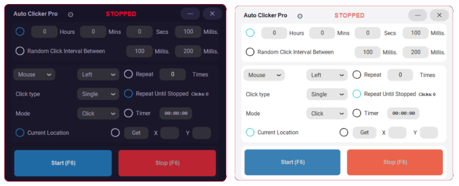

# 🖱️ Auto Clicker Pro

A modern, fast, and lightweight Auto Clicker.

## 🔥 Why Auto Clicker Pro?

* Open-source and lightweight
* Fast click engine
* Keyboard support
* Modern and clean UI

## ⚙️ Features

* Mouse & Keyboard automation
* Click at current location or exact coordinates
* Set precise fixed or random intervals (human-like)
* Run forever, repeat N times, or set a countdown timer
* Single, Double, and Hold click modes
* Custom global hotkey
* Customizable Light and Dark themes

## 🎨 Design

A modern user interface with Dark/Light themes

 

## 📥 How to Install & Run

**No Python installation required!**

1. Go to the **[Releases](https://github.com/guilhermemaia-dev/AutoClickerPro/releases)** tab
2. Download the `AutoClickerPro.exe` file
3. Double-click to run

Warning: When starting AutoClickPro.exe, Windows SmartScreen may display a warning.
 
To run the application you have to Press **More Info** and then **Run anyways**
 
or go to **Windows Settings ➔ Privacy & Security ➔ Windows Security ➔ App & browser control**
 
and Adjust or allow the application to run

Built with **Python** • **[MIT License](LICENSE)**

